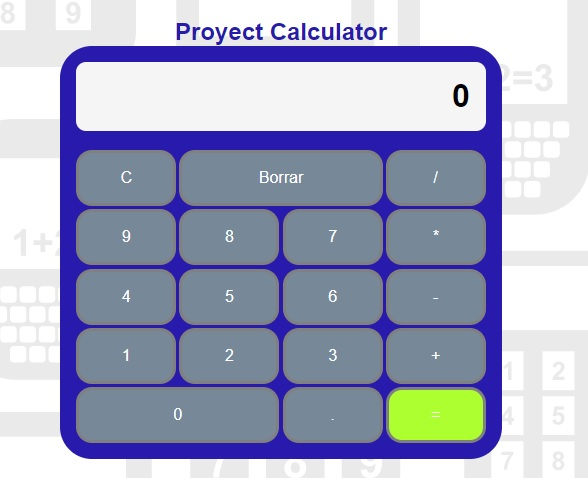

# Project name: The Calculator project

Objetive: 
- Create a calculator with HTML5, CSS3 and JavaScript.

_Description:_

The idea is develop a calculator with basic functions that allow the operations of adding, subtracting, multiplying and dividing. Also delete and announce errors.

## CONTENTS

- [Project name: The Calculator project](#project-name-the-calculator-project)
  - [CONTENTS](#contents)
    - [General Information](#general-information)
    - [Technology](#technology)
      - [Developer:](#developer)

### General Information
In order to make this calculator, various pages were consulted, choosing the Capri Coder repository. This repository has been generated by him and in my version I have changed the styles and I have customized it to my liking. Regarding the JS I have followed your tutorial since of the ones I have seen it is the one that seemed easiest to understand. This is the consulted repository: https://github.com/carpicoder/calculadora-js
### Technology

#### Developer:
     Ana Lucía Silva Córdoba.
